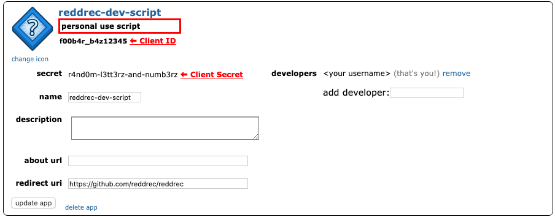

# Reddrec

Reddrec is a web app that provides subreddit recommendations.

[](https://circleci.com/gh/reddrec/reddrec)

## Initial setup

Reddrec is super simple to build and run. A little initial setup makes things ez-pz.

First let's get the following: [Docker](https://www.docker.com/get-started), [Nodejs](https://nodejs.org/en/), [a Reddit account](https://www.reddit.com/)

Next we'll create a new Reddit developer app (it's free): [reddit.com/prefs/apps](https://www.reddit.com/prefs/apps/). Create a "script" app as we are not using refresh tokens yet. In the future we will use the proper "web app" scopes.



Finally we need to add our Reddit secrets to our environment. We recommend having these at login in your `.bash_profile` (or similar):

```bash
# reddrec .. Environment for main app stuff
export reddrec_praw_client_id='app-client-id-replace-me'
export reddrec_praw_client_secret='app-client-s3cr3t-replace-me'
export reddrec_praw_username='app-username-replace-me'
export reddrec_praw_password='app-p4ssw0rd-replace-me'
export reddrec_praw_user_agent='github.com/reddrec (crawler)'

# reddrec .. Environment for integration tests
export prawtest_client_id='test-client-id-replace-me'
export prawtest_client_secret='test-client-s3cr3t-replace-me'
export prawtest_username='test-username-replace-me'
export prawtest_password='test-p4ssw0rd-replace-me'
export prawtest_user_agent='github.com/reddrec (integration test)'
```

Feel free to leave the user agent as-is. Don't spoof a browser as that's against Reddit's API terms. If you fork Reddrec, we ask that you change the user agent string to reflect your fork.

[see: praw docs](https://praw.readthedocs.io/en/latest/package_info/contributing.html?highlight=testing#adding-and-updating-integration-tests)

## Building

```
docker-compose build
docker-compose run refresh_datadeps
(cd webpage; npm install)
```

Building can take a few minutes. Source code will live-update when running, so
you generally only have to re-build when installing a new dependency.

## Running

```
docker-compose up -d reddrec
(cd webpage; npm start)
```

Frontend (React) goes live at [localhost:3000](http://localhost:3000). Requests for `/recommend` are proxied to the backend.

Backend (Flask api) goes live at [localhost:5000](http://localhost:5000).

View live logs:

```
docker-compose logs -f
```

## Testing

```
docker-compose run test
```
